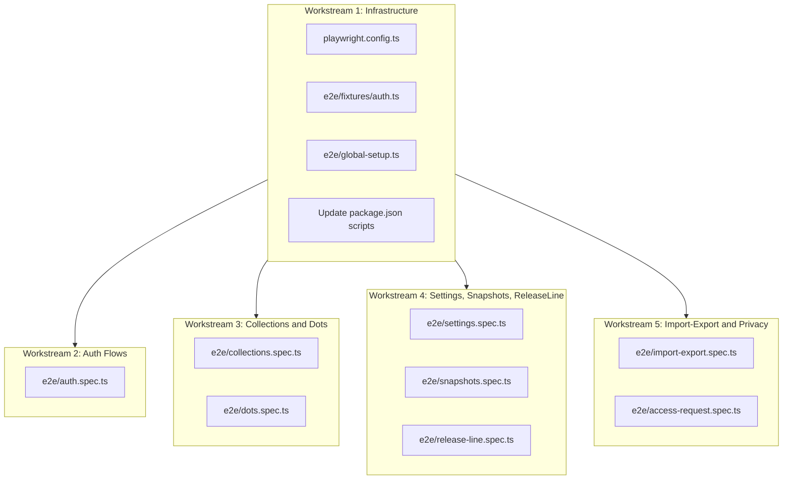

# Playwright E2E Test Coverage

## Current State

- **No** `playwright.config.ts` exists; `npm test` runs `playwright test` which tries to load Jest-style `.test.ts` files and fails.
- **No** `e2e/` directory or `*.spec.ts` files.
- Two ad-hoc scripts (`scripts/playwright-stitch-validate.mjs`) exist but are not structured tests.
- Jest (222 tests, 95% coverage) handles unit/integration well; E2E is the gap.

## Architecture

## Workstream 1: Infrastructure (must complete first)

### `playwright.config.ts`

- Base URL: `http://localhost:3000` (configurable via `PLAYWRIGHT_BASE_URL` env)
- Projects: `chromium` (primary), `firefox`, `webkit` (smoke only)
- Test directory: `e2e/`
- `testMatch: '**/*.spec.ts'`
- `webServer` block to auto-start `npm run dev` if not already running
- Reporter: `html` + `list`
- Retries: 1 on CI, 0 locally
- Timeout: 30s per test, 5s per action

### `e2e/fixtures/auth.ts`

A Playwright fixture that extends `test` with an `authenticatedPage` that:

1. Navigates to `/`
2. Fills email/password from env vars (`PLAYWRIGHT_EMAIL`, `PLAYWRIGHT_PASSWORD`)
3. Submits sign-in and waits for the hill chart to appear
4. Saves storage state to `e2e/.auth/user.json` for reuse

This avoids re-authenticating in every test. Tests needing unauthenticated state use the default `page`.

### `e2e/global-setup.ts`

Runs once before the suite to create the auth storage state file.

### Package and config updates

- [package.json](package.json): keep `"test": "playwright test"` as-is; it will now find `e2e/*.spec.ts` via `playwright.config.ts`
- [jest.config.js](jest.config.js): already excludes `e2e` via `!**/*.e2e.(test|spec)` pattern; add `'<rootDir>/e2e/'` to `testPathIgnorePatterns` for safety

---

## Workstream 2: Auth Flows (`e2e/auth.spec.ts`)

**6-8 tests** covering the sign-in page and auth lifecycle:

- **Sign in with valid credentials** - fill email/password, submit, assert hill chart renders
- **Sign in with invalid credentials** - wrong password, assert error message visible
- **Sign out** - from authenticated state, open settings menu, click sign out, assert sign-in form returns
- **Empty form submission** - submit without filling, assert validation/error
- **Magic link button** - click "Send Magic Link", assert success toast/message (no actual email)
- **Request access link** - click "Request Access", assert `RequestAccessForm` appears
- **Forgot password link** - click forgot password, assert reset modal appears with email input
- **Session persistence** - sign in, reload page, assert still authenticated (no re-login)

---

## Workstream 3: Collections and Dots

### `e2e/collections.spec.ts` (6-8 tests)

All start from authenticated state:

- **Default collection loads** - assert at least one collection visible in dropdown/selector
- **Create new collection** - type name, submit, assert it appears in the selector
- **Rename collection** - trigger inline edit, change name, save, assert new name persists
- **Archive collection** - open menu, archive, assert collection disappears from active list
- **View archived collections** - open archived modal, assert archived collection visible, unarchive it
- **Delete collection** - open menu, delete with confirmation, assert removed
- **Collection name conflict** - create collection with existing name, assert conflict modal

### `e2e/dots.spec.ts` (5-7 tests)

- **Add a dot** - type label in input, submit, assert dot appears on the SVG chart
- **Edit dot label** - click dot, edit label inline, assert updated
- **Delete dot** - open dot context menu, delete with confirmation, assert removed
- **Flag for today** - flag a dot, assert visual indicator
- **Dot drag interaction** - mousedown on dot, drag along the curve, mouseup, assert position changed (x value updated)
- **Batch delete** - select multiple dots, batch delete, assert all removed

---

## Workstream 4: Settings, Snapshots, Release Line

### `e2e/settings.spec.ts` (5-6 tests)

- **Open settings menu** - click ellipsis/overflow button, assert settings modal opens
- **Toggle theme** - switch between light/dark/system, assert `html` class changes
- **Toggle hide collection name** - flip toggle, assert collection name visibility on chart
- **Toggle copy format** - switch PNG/SVG, assert preference saved (via UI indicator)
- **Color settings modal** - open, change a dot color, assert it updates on chart
- **Close settings** - close modal, assert it's dismissed

### `e2e/snapshots.spec.ts` (4-5 tests)

- **Create snapshot** - trigger snapshot creation, assert success feedback
- **View snapshot list** - assert snapshot appears in list with correct date
- **Load snapshot** - click a snapshot, assert chart enters read-only snapshot view
- **Return to live view** - exit snapshot mode, assert chart is editable again
- **Delete snapshot** - delete from list, assert removed

### `e2e/release-line.spec.ts` (3-4 tests)

- **Enable release line** - toggle switch on, assert line appears on SVG chart
- **Set release line color** - change hex color, assert the line color updates
- **Set release line text** - type label (max 12 chars), assert text visible on chart
- **Disable release line** - toggle off, assert line disappears

---

## Workstream 5: Import/Export and Access Request

### `e2e/import-export.spec.ts` (3-4 tests)

- **Export data** - trigger JSON export from settings, assert file downloads with correct structure
- **Import data** - upload a valid JSON file, assert collections/dots appear
- **Import invalid data** - upload malformed JSON, assert error message
- **Import legacy localStorage data** - mock localStorage with legacy keys, reload, assert `ImportDataPrompt` appears

### `e2e/access-request.spec.ts` (3 tests)

From unauthenticated state:

- **Submit access request** - fill email + message, submit, assert success message
- **Submit with invalid email** - enter bad email, assert validation error
- **Submit empty form** - submit without email, assert required field error

---

## Test Count Summary

| Spec file                | Tests     |
| ------------------------ | --------- |
| `auth.spec.ts`           | 6-8       |
| `collections.spec.ts`    | 6-8       |
| `dots.spec.ts`           | 5-7       |
| `settings.spec.ts`       | 5-6       |
| `snapshots.spec.ts`      | 4-5       |
| `release-line.spec.ts`   | 3-4       |
| `import-export.spec.ts`  | 3-4       |
| `access-request.spec.ts` | 3         |
| **Total**                | **35-45** |

## Parallel Execution Strategy

Infrastructure (workstream 1) runs first. Then workstreams 2-5 run in parallel as independent sub-agents, each creating their own spec files. All spec files share the auth fixture from workstream 1.

## Key Files to Modify

- [package.json](package.json) - no script changes needed (already uses `playwright test`)
- [jest.config.js](jest.config.js) - add `e2e/` to `testPathIgnorePatterns`

## Key Files to Create

- `playwright.config.ts`
- `e2e/global-setup.ts`
- `e2e/fixtures/auth.ts`
- `e2e/auth.spec.ts`
- `e2e/collections.spec.ts`
- `e2e/dots.spec.ts`
- `e2e/settings.spec.ts`
- `e2e/snapshots.spec.ts`
- `e2e/release-line.spec.ts`
- `e2e/import-export.spec.ts`
- `e2e/access-request.spec.ts`

