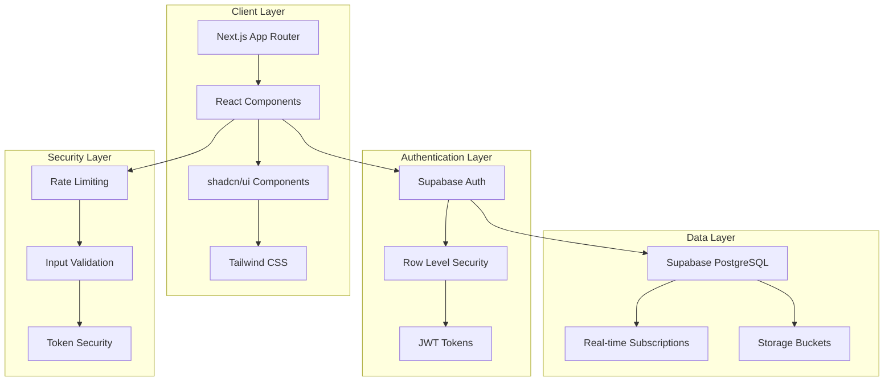
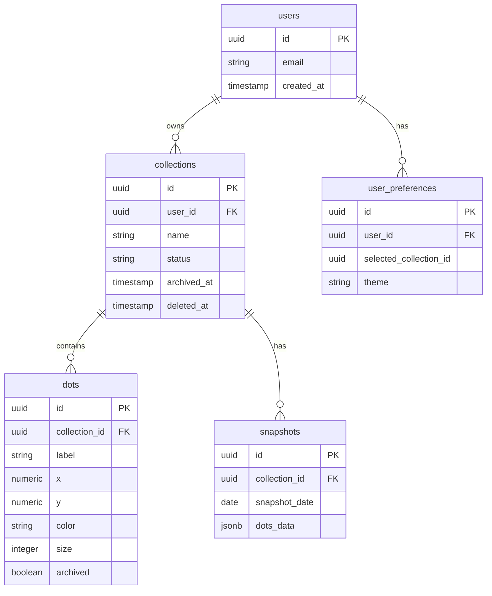

# Design Document

## Overview

Over the Hill is a sophisticated SaaS Hill Chart visualization platform built with Next.js 15, React 19, and Supabase. The application transforms the concept of Hill Charts (popularized by 37signals) into a comprehensive project management tool with multi-tenant architecture, real-time collaboration capabilities, and advanced data management features.

The system architecture follows modern web application patterns with a React-based frontend, Supabase backend for authentication and data persistence, and a component-driven UI built with shadcn/ui and Tailwind CSS.

## Architecture

### System Architecture



### Technology Stack

- **Frontend Framework**: Next.js 15.2.4 with App Router
- **UI Framework**: React 19 with TypeScript
- **Styling**: Tailwind CSS 3.4.17 with shadcn/ui components
- **Backend**: Supabase (PostgreSQL, Auth, Real-time, Storage)
- **Authentication**: Supabase Auth with invite-only access
- **State Management**: React hooks with Supabase real-time subscriptions
- **Build Tools**: pnpm, ESLint, PostCSS

### Deployment Architecture

- **Frontend**: Static site generation with Next.js
- **Backend**: Supabase managed infrastructure
- **CDN**: Vercel Edge Network
- **Database**: Supabase PostgreSQL with Row Level Security
- **Authentication**: Supabase Auth with custom email templates

## Components and Interfaces

### Core Components

#### 1. Authentication System

**AuthProvider Component**
- Manages global authentication state
- Handles session management and refresh
- Provides user context throughout the application

**SignInForm Component**
- Email/password authentication
- Magic link authentication option
- Password reset functionality
- Request access integration

**ResetPasswordPage Component**
- Secure password reset flow using Supabase auth events
- Token validation and processing
- User-friendly error handling

#### 2. Hill Chart Visualization

**HillChartApp Component** (Main Application)
- Central component managing all Hill Chart functionality
- Handles collection management, dot manipulation, and export features
- Integrates with Supabase for real-time data persistence

**Hill Chart SVG Rendering**
- Bell curve path generation using mathematical formula
- Drag-and-drop dot positioning with real-time updates
- Label collision detection and stacking system
- Export-ready SVG with proper viewBox constraints

#### 3. Collection Management System

**Collection Interface**
```typescript
interface Collection {
  id: string
  name: string
  status: 'active' | 'archived' | 'deleted'
  archived_at?: string
  deleted_at?: string
  dots: Dot[]
}
```

**Archive Management Modal**
- Dedicated interface for archived collections
- Unarchive and permanent delete operations
- Professional modal design with confirmation workflows

#### 4. Dot Management

**Dot Interface**
```typescript
interface Dot {
  id: string
  label: string
  x: number
  y: number
  color: string
  size: number
  archived: boolean
}
```

**Dot Customization**
- Inline editing for labels, colors, and sizes
- Color palette with predefined options
- Size scaling from 1-5 with visual feedback
- Archive/delete operations with confirmation

#### 5. Snapshot System

**Snapshot Interface**
```typescript
interface Snapshot {
  date: string
  collectionId: string
  collectionName: string
  dots: Dot[]
  timestamp: number
}
```

**Calendar-based Navigation**
- Visual calendar interface for snapshot selection
- Previous/next navigation between snapshots
- Snapshot creation and restoration functionality

### UI Component Architecture

#### Design System Integration

**shadcn/ui Components Used:**
- Button, Card, Input, Select components
- Modal dialogs and dropdown menus
- Form controls and validation
- Theme provider for light/dark modes

**Custom Component Patterns:**
- Confirmation dialogs with consistent styling
- Professional modal interfaces
- Responsive grid layouts
- Interactive SVG elements

#### Responsive Design

**Layout Structure:**
- Main chart area (2.4fr) + Sidebar (1.2fr) grid layout
- Mobile-first responsive design
- Collapsible sidebar for smaller screens
- Touch-friendly controls for mobile devices

## Data Models

### Database Schema

#### Collections Table
```sql
CREATE TABLE collections (
  id UUID PRIMARY KEY DEFAULT gen_random_uuid(),
  user_id UUID REFERENCES auth.users(id) ON DELETE CASCADE,
  name TEXT NOT NULL,
  status TEXT NOT NULL DEFAULT 'active' 
    CHECK (status IN ('active', 'archived', 'deleted')),
  archived_at TIMESTAMP WITH TIME ZONE,
  deleted_at TIMESTAMP WITH TIME ZONE,
  created_at TIMESTAMP WITH TIME ZONE DEFAULT NOW(),
  updated_at TIMESTAMP WITH TIME ZONE DEFAULT NOW()
);
```

#### Dots Table
```sql
CREATE TABLE dots (
  id UUID PRIMARY KEY DEFAULT gen_random_uuid(),
  collection_id UUID REFERENCES collections(id) ON DELETE CASCADE,
  label TEXT NOT NULL,
  x NUMERIC NOT NULL,
  y NUMERIC NOT NULL,
  color TEXT NOT NULL,
  size INTEGER NOT NULL CHECK (size >= 1 AND size <= 5),
  archived BOOLEAN NOT NULL DEFAULT FALSE,
  created_at TIMESTAMP WITH TIME ZONE DEFAULT NOW(),
  updated_at TIMESTAMP WITH TIME ZONE DEFAULT NOW()
);
```

#### Snapshots Table
```sql
CREATE TABLE snapshots (
  id UUID PRIMARY KEY DEFAULT gen_random_uuid(),
  collection_id UUID REFERENCES collections(id) ON DELETE CASCADE,
  snapshot_date DATE NOT NULL,
  dots_data JSONB NOT NULL,
  created_at TIMESTAMP WITH TIME ZONE DEFAULT NOW()
);
```

#### User Preferences Table
```sql
CREATE TABLE user_preferences (
  id UUID PRIMARY KEY DEFAULT gen_random_uuid(),
  user_id UUID REFERENCES auth.users(id) ON DELETE CASCADE,
  selected_collection_id UUID,
  theme TEXT DEFAULT 'system',
  created_at TIMESTAMP WITH TIME ZONE DEFAULT NOW(),
  updated_at TIMESTAMP WITH TIME ZONE DEFAULT NOW()
);
```

### Row Level Security Policies

**Collections RLS:**
```sql
-- Users can only access their own collections
CREATE POLICY "Users can manage their own collections" ON collections
  FOR ALL USING (auth.uid() = user_id);

-- Filter out deleted collections from normal queries
CREATE POLICY "Users can view active/archived collections" ON collections
  FOR SELECT USING (auth.uid() = user_id AND status != 'deleted');
```

**Dots RLS:**
```sql
-- Users can only access dots in their collections
CREATE POLICY "Users can manage dots in their collections" ON dots
  FOR ALL USING (
    collection_id IN (
      SELECT id FROM collections 
      WHERE user_id = auth.uid()
    )
  );
```

### Data Relationships



## Error Handling

### Client-Side Error Handling

**Authentication Errors:**
- Invalid credentials with user-friendly messages
- Session expiration with automatic refresh attempts
- Network connectivity issues with retry mechanisms

**Data Validation Errors:**
- Input validation with real-time feedback
- Form submission errors with field-specific messages
- File import validation with detailed error reporting

**UI Error Boundaries:**
- React error boundaries for component failures
- Graceful degradation for non-critical features
- Error reporting without sensitive information exposure

### Server-Side Error Handling

**Database Errors:**
- Connection failures with retry logic
- Constraint violations with user-friendly messages
- Transaction rollbacks for data consistency

**Authentication Errors:**
- Token validation failures
- Rate limiting enforcement
- Unauthorized access attempts

**API Error Responses:**
```typescript
interface ErrorResponse {
  error: string
  message: string
  code?: string
  details?: any
}
```

### Security Error Handling

**Token Security:**
- Rate limiting with sliding window implementation
- Token validation with comprehensive checks
- Secure error messages without information leakage

**Input Validation:**
- SQL injection prevention
- XSS protection with input sanitization
- File upload validation and size limits

## Testing Strategy

### Unit Testing

**Component Testing:**
- React component rendering and behavior
- Hook functionality and state management
- Utility function validation
- Service layer operations

**Test Coverage Areas:**
- Authentication flows
- Data manipulation operations
- UI component interactions
- Error handling scenarios

### Integration Testing

**API Integration:**
- Supabase service integration
- Authentication flow testing
- Data persistence validation
- Real-time subscription testing

**End-to-End Testing:**
- Complete user workflows
- Cross-browser compatibility
- Mobile responsiveness
- Performance benchmarks

### Security Testing

**Authentication Testing:**
- Token validation and expiration
- Rate limiting effectiveness
- Session management security
- Password reset flow security

**Data Security Testing:**
- Row Level Security policy validation
- Input sanitization effectiveness
- SQL injection prevention
- XSS protection validation

### Performance Testing

**Load Testing:**
- Concurrent user simulation
- Database query performance
- Real-time subscription scalability
- Export operation performance

**Frontend Performance:**
- Bundle size optimization
- Rendering performance
- Memory usage monitoring
- Network request optimization

## Security Considerations

### Authentication Security

**Invite-Only Access:**
- Token-based invitation system
- Email verification requirements
- Account approval workflow
- Secure token generation and validation

**Session Management:**
- JWT token security
- Automatic session refresh
- Secure logout procedures
- Session timeout handling

### Data Security

**Row Level Security:**
- User data isolation
- Policy-based access control
- Audit trail maintenance
- Data encryption at rest

**Input Validation:**
- Comprehensive input sanitization
- SQL injection prevention
- XSS protection measures
- File upload security

### Infrastructure Security

**Network Security:**
- HTTPS enforcement
- CORS policy configuration
- Rate limiting implementation
- DDoS protection measures

**Monitoring and Logging:**
- Security event logging
- Anomaly detection
- Performance monitoring
- Error tracking and alerting

## Performance Optimization

### Frontend Optimization

**Code Splitting:**
- Route-based code splitting
- Component lazy loading
- Dynamic imports for heavy features
- Bundle size optimization

**Rendering Optimization:**
- React.memo for expensive components
- Efficient state updates
- Virtual scrolling for large lists
- Optimized SVG rendering

### Backend Optimization

**Database Optimization:**
- Proper indexing strategy
- Query optimization
- Connection pooling
- Caching implementation

**API Optimization:**
- Response compression
- Efficient data serialization
- Batch operations
- Real-time subscription optimization

### Caching Strategy

**Client-Side Caching:**
- Browser cache optimization
- Service worker implementation
- Local storage management
- Memory cache for frequently accessed data

**Server-Side Caching:**
- Database query caching
- API response caching
- Static asset caching
- CDN optimization