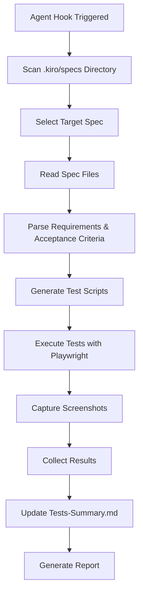

# Design Document

## Overview

The automated spec QA system will be implemented as an agent hook that analyzes completed feature specifications and automatically generates, executes, and reports on comprehensive QA test scripts. The system will use Playwright for browser automation, maintain the existing QA framework structure, and organize results by specification folders rather than test categories.

## Architecture

### System Components
```
Automated QA System
├── Agent Hook Trigger
├── Spec Analyzer
├── Test Script Generator
├── Playwright Test Runner
├── Screenshot Capture System
└── Report Generator
```

### Data Flow


### Integration Points
- **Existing QA Framework**: Maintains compatibility with current structure
- **Playwright MCP**: Uses configured Playwright server for browser automation
- **Spec Files**: Reads from .kiro/specs/{spec-name}/ directories
- **QA Directory**: Outputs to existing QA/scripts/ and QA/assets/ structure

## Components and Interfaces

### Agent Hook Interface
```typescript
interface QAAgentHook {
  name: string;
  description: string;
  trigger: 'manual';
  execute: (specName?: string) => Promise<QAResult>;
}
```

### Spec Analyzer
```typescript
interface SpecAnalyzer {
  scanSpecs(): Promise<string[]>;
  readSpecFiles(specName: string): Promise<SpecFiles>;
  parseRequirements(requirements: string): AcceptanceCriteria[];
}

interface SpecFiles {
  requirements: string;
  design: string;
  tasks: string;
}

interface AcceptanceCriteria {
  id: string;
  description: string;
  testable: boolean;
  steps: TestStep[];
}
```

### Test Script Generator
```typescript
interface TestScriptGenerator {
  generateTestScript(criteria: AcceptanceCriteria[], specName: string): TestScript;
  createTestStructure(specName: string): Promise<void>;
}

interface TestScript {
  fileName: string;
  content: string;
  steps: TestStep[];
}

interface TestStep {
  id: string;
  description: string;
  action: PlaywrightAction;
  expectedResult: string;
  screenshotName: string;
}
```

### Test Runner
```typescript
interface PlaywrightTestRunner {
  executeTest(script: TestScript, specName: string): Promise<TestResult>;
  captureScreenshot(stepId: string, specName: string): Promise<string>;
  validateResult(step: TestStep): Promise<boolean>;
}

interface TestResult {
  specName: string;
  steps: StepResult[];
  overallStatus: 'Passed' | 'Failed';
  executionTime: number;
  screenshots: string[];
}

interface StepResult {
  stepId: string;
  status: 'Passed' | 'Failed';
  screenshot: string;
  errorMessage?: string;
}
```

### Report Generator
```typescript
interface ReportGenerator {
  updateTestsSummary(results: TestResult[]): Promise<void>;
  generateSpecSection(result: TestResult): string;
  organizeBySpecs(results: TestResult[]): SpecSection[];
}

interface SpecSection {
  specName: string;
  description: string;
  testResults: TestResult[];
  overallStatus: 'Passed' | 'Failed';
}
```

## Data Models

### Test Configuration
```typescript
interface QAConfig {
  baseUrl: string;
  screenshotPath: string;
  testTimeout: number;
  browserOptions: PlaywrightBrowserOptions;
}
```

### Spec Metadata
```typescript
interface SpecMetadata {
  name: string;
  path: string;
  status: 'completed' | 'in-progress' | 'not-started';
  lastModified: Date;
  hasRequirements: boolean;
  hasDesign: boolean;
  hasTasks: boolean;
}
```

## Error Handling

### Spec Analysis Errors
- **Missing spec files**: Log warning and skip spec
- **Malformed requirements**: Extract what's possible, report issues
- **No testable criteria**: Generate basic navigation test

### Test Execution Errors
- **Browser launch failures**: Retry with different options, fallback to headless
- **Element not found**: Capture screenshot, continue with next step
- **Timeout errors**: Increase timeout, retry once, then fail gracefully

### File System Errors
- **Permission issues**: Log error, suggest manual intervention
- **Disk space**: Check available space, clean up old screenshots if needed
- **Path conflicts**: Generate unique names, avoid overwrites

## Testing Strategy

### Unit Tests
1. **Spec Analyzer Tests**
   - Test parsing of requirements files
   - Test extraction of acceptance criteria
   - Test handling of malformed spec files

2. **Test Generator Tests**
   - Test script generation from acceptance criteria
   - Test file structure creation
   - Test naming convention compliance

3. **Report Generator Tests**
   - Test summary file updates
   - Test spec-based organization
   - Test markdown formatting

### Integration Tests
1. **End-to-End QA Process**
   - Test complete flow from spec to report
   - Test with password-visibility-toggle spec
   - Test error handling and recovery

2. **Playwright Integration**
   - Test browser automation
   - Test screenshot capture
   - Test test execution and result collection

### Manual Validation Tests
1. **Agent Hook Integration**
   - Test hook registration and execution
   - Test manual trigger functionality
   - Test integration with Kiro IDE

## Implementation Approach

### Phase 1: Core Infrastructure
1. Create agent hook structure and registration
2. Implement spec analyzer for reading and parsing spec files
3. Build basic test script generator framework

### Phase 2: Test Generation
1. Implement acceptance criteria parsing
2. Create Playwright test script templates
3. Build test step generation logic

### Phase 3: Test Execution
1. Integrate with Playwright MCP server
2. Implement screenshot capture system
3. Build result collection and validation

### Phase 4: Reporting
1. Create spec-based report generator
2. Update Tests-Summary.md format
3. Implement result organization and formatting

### Phase 5: MVP Validation
1. Test with password-visibility-toggle spec
2. Validate complete end-to-end flow
3. Refine and optimize based on results

## Security Considerations

### Test Isolation
- Tests run in isolated browser contexts
- No persistent data between test runs
- Clean up temporary files after execution

### Credential Management
- No hardcoded credentials in generated tests
- Use environment variables for test accounts
- Avoid logging sensitive information

### File System Security
- Validate all file paths before operations
- Prevent directory traversal attacks
- Use safe file naming conventions

## Dependencies

### Existing Dependencies
- **Playwright MCP**: Browser automation and testing
- **Node.js/TypeScript**: Runtime and type safety
- **File System APIs**: Reading specs and writing results

### New Dependencies
- **Markdown Parser**: For parsing spec files (marked or similar)
- **Template Engine**: For generating test scripts (handlebars or similar)
- **Path Utilities**: For safe file operations

## Configuration

### Agent Hook Configuration
```json
{
  "name": "automated-qa-system",
  "description": "Generate and run QA tests from specifications",
  "trigger": "manual",
  "config": {
    "baseUrl": "http://localhost:3001",
    "timeout": 30000,
    "screenshotQuality": 90,
    "headless": false
  }
}
```

### QA System Settings
```typescript
const QA_CONFIG = {
  SPECS_DIR: '.kiro/specs',
  QA_SCRIPTS_DIR: 'QA/scripts',
  QA_ASSETS_DIR: 'QA/assets',
  TESTS_SUMMARY_FILE: 'QA/Tests-Summary.md',
  SUPPORTED_SPEC_STATUS: ['completed'],
  MAX_SCREENSHOT_SIZE: '1920x1080'
};
```