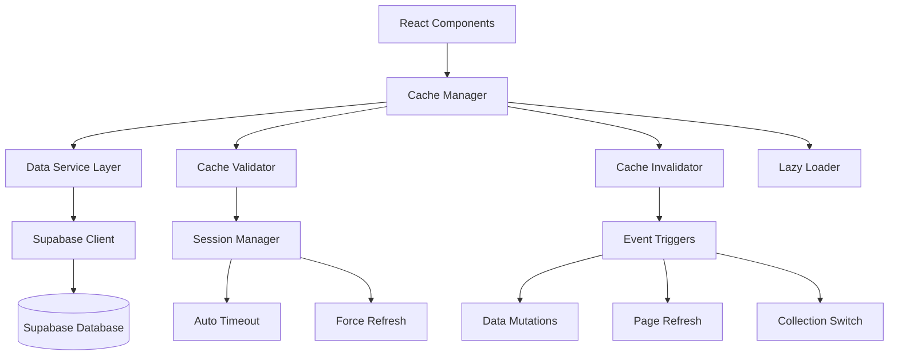

# Design Document

## Overview

The Over The Hill application currently suffers from data synchronization issues where local browser storage (localStorage, sessionStorage, IndexedDB, cache storage) becomes stale and serves outdated data instead of fetching fresh data from the Supabase database. This design addresses the root cause by implementing a comprehensive cache management system with intelligent invalidation, session management improvements, and optimized data loading strategies.

## Architecture

### Current State Analysis

Based on code analysis, the current architecture has these characteristics:

1. **Data Flow**: React components → Supabase service layer → Supabase database
2. **No Explicit Caching**: The app doesn't implement explicit caching in code, but browsers are caching data through:
   - Service workers (4.1 kB detected)
   - Browser cache storage (76.5 kB detected)
   - Potential localStorage/sessionStorage usage by Supabase client
   - IndexedDB usage by Supabase client for auth tokens

3. **Session Management**: Uses Supabase auth with periodic validation (every 5 minutes) and automatic refresh

4. **Data Loading**: All collections and dots are loaded upfront in `useEffect` when user changes

### Proposed Architecture



## Components and Interfaces

### 1. Cache Manager

**Purpose**: Central orchestrator for all caching operations and data freshness validation.

**Interface**:
```typescript
interface CacheManager {
  // Cache operations
  get<T>(key: string): Promise<T | null>
  set<T>(key: string, data: T, ttl?: number): Promise<void>
  invalidate(key: string | string[]): Promise<void>
  clear(): Promise<void>
  
  // Freshness validation
  isStale(key: string): Promise<boolean>
  validateFreshness(key: string): Promise<boolean>
  
  // Batch operations
  invalidatePattern(pattern: string): Promise<void>
  refreshStaleData(): Promise<void>
}
```

**Implementation Strategy**:
- Wrapper around browser storage APIs with metadata tracking
- TTL (Time To Live) support for automatic expiration
- Version-based cache invalidation
- Pattern-based cache key management

### 2. Data Service Layer Enhancement

**Purpose**: Enhanced service layer with cache-aware data operations.

**Interface**:
```typescript
interface CacheAwareDataService {
  // Collection operations with cache management
  fetchCollections(userId: string, forceRefresh?: boolean): Promise<Collection[]>
  addCollection(collection: Collection, userId: string): Promise<Collection | null>
  updateCollection(id: string, name: string, userId: string): Promise<boolean>
  
  // Dot operations with cache management
  fetchDots(collectionId: string, forceRefresh?: boolean): Promise<Dot[]>
  addDot(dot: Dot, collectionId: string, userId: string): Promise<Dot | null>
  updateDot(dot: Dot, userId: string): Promise<Dot | null>
  
  // Cache invalidation hooks
  onDataMutation(operation: string, entityType: string, entityId: string): Promise<void>
}
```

### 3. Session Manager Enhancement

**Purpose**: Improved session management with automatic logout and cache clearing.

**Interface**:
```typescript
interface EnhancedSessionManager {
  // Inactivity management
  startInactivityTimer(timeoutMs: number): void
  resetInactivityTimer(): void
  onInactivityTimeout(): Promise<void>
  
  // Session validation with cache implications
  validateSession(): Promise<ValidationResponse>
  onSessionExpiry(): Promise<void>
  onLogin(): Promise<void>
  
  // Cache coordination
  clearUserCache(): Promise<void>
  forceDataRefresh(): Promise<void>
}
```

### 4. Lazy Loading System

**Purpose**: Efficient data loading strategy for scalability with large datasets.

**Interface**:
```typescript
interface LazyLoader {
  // Collection loading
  loadCollectionList(userId: string): Promise<CollectionSummary[]>
  loadCollectionData(collectionId: string, userId: string): Promise<Collection>
  
  // Pagination support
  loadCollectionsPaginated(userId: string, page: number, limit: number): Promise<PaginatedResult<Collection>>
  
  // Preloading strategies
  preloadNextCollection(currentId: string): Promise<void>
  preloadRecentCollections(userId: string, limit: number): Promise<void>
}
```

## Data Models

### Cache Entry Model

```typescript
interface CacheEntry<T> {
  key: string
  data: T
  timestamp: number
  ttl: number
  version: string
  userId: string
  entityType: 'collection' | 'dot' | 'snapshot' | 'user_preferences'
  entityId?: string
}
```

### Cache Metadata Model

```typescript
interface CacheMetadata {
  version: string
  lastSync: number
  userId: string
  sessionId: string
  invalidationRules: InvalidationRule[]
}
```

### Invalidation Rule Model

```typescript
interface InvalidationRule {
  trigger: 'mutation' | 'time' | 'session' | 'manual'
  pattern: string
  entityTypes: string[]
  cascadeRules?: string[]
}
```

## Error Handling

### Cache Corruption Recovery

1. **Detection**: Implement checksum validation for cached data
2. **Recovery**: Automatic fallback to fresh data fetch on corruption
3. **Logging**: Detailed error logging for cache corruption incidents

### Network Failure Handling

1. **Offline Detection**: Monitor network connectivity status
2. **Graceful Degradation**: Serve stale cache with clear indicators
3. **Retry Logic**: Exponential backoff for failed refresh attempts

### Session Expiry Handling

1. **Proactive Detection**: Check session validity before cache operations
2. **Automatic Cleanup**: Clear user-specific cache on session expiry
3. **Seamless Recovery**: Force fresh login and data reload

## Testing Strategy

### Unit Tests

1. **Cache Manager Tests**:
   - TTL expiration behavior
   - Invalidation pattern matching
   - Concurrent access handling

2. **Data Service Tests**:
   - Cache hit/miss scenarios
   - Mutation-triggered invalidation
   - Error recovery paths

3. **Session Manager Tests**:
   - Inactivity timeout behavior
   - Session validation edge cases
   - Cache clearing on logout

### Integration Tests

1. **End-to-End Cache Flow**:
   - Complete user journey with cache interactions
   - Cross-tab synchronization scenarios
   - Network interruption recovery

2. **Performance Tests**:
   - Large dataset loading performance
   - Cache memory usage optimization
   - Concurrent user simulation

### Browser Compatibility Tests

1. **Storage API Support**:
   - localStorage/sessionStorage availability
   - IndexedDB feature detection
   - Service worker compatibility

2. **Cross-Browser Behavior**:
   - Cache eviction policies
   - Storage quota handling
   - Performance characteristics

## Implementation Phases

### Phase 1: Cache Infrastructure

1. Implement `CacheManager` with basic operations
2. Add cache metadata tracking
3. Implement TTL-based expiration
4. Add pattern-based invalidation

### Phase 2: Service Layer Integration

1. Enhance `supabaseService.ts` with cache awareness
2. Implement mutation-triggered invalidation
3. Add force refresh capabilities
4. Integrate with existing data operations

### Phase 3: Session Management Enhancement

1. Implement inactivity timeout with configurable duration
2. Add automatic cache clearing on session events
3. Implement force refresh on login
4. Add session-based cache isolation

### Phase 4: Lazy Loading Implementation

1. Implement collection list vs. collection data separation
2. Add pagination support for large datasets
3. Implement preloading strategies
4. Add loading state management

### Phase 5: UI Integration and Polish

1. Add loading indicators for cache refresh operations
2. Implement offline/stale data indicators
3. Add user controls for manual refresh
4. Implement error recovery UI flows

## Configuration Options

### Cache Configuration

```typescript
interface CacheConfig {
  defaultTTL: number // Default: 5 minutes
  maxCacheSize: number // Default: 50MB
  cleanupInterval: number // Default: 1 hour
  compressionEnabled: boolean // Default: true
}
```

### Session Configuration

```typescript
interface SessionConfig {
  inactivityTimeout: number // Default: 30 minutes
  sessionValidationInterval: number // Default: 5 minutes
  forceRefreshOnLogin: boolean // Default: true
  clearCacheOnLogout: boolean // Default: true
}
```

### Loading Configuration

```typescript
interface LoadingConfig {
  lazyLoadingEnabled: boolean // Default: true
  collectionPageSize: number // Default: 50
  preloadCount: number // Default: 3
  loadingDebounceMs: number // Default: 300
}
```

## Performance Considerations

### Memory Management

1. **Cache Size Limits**: Implement configurable cache size limits with LRU eviction
2. **Compression**: Use compression for large cached objects
3. **Cleanup Scheduling**: Regular cleanup of expired cache entries

### Network Optimization

1. **Batch Operations**: Group multiple cache refresh operations
2. **Conditional Requests**: Use ETags or timestamps for conditional fetching
3. **Request Deduplication**: Prevent duplicate requests for same data

### User Experience

1. **Progressive Loading**: Show cached data immediately, refresh in background
2. **Loading States**: Clear indicators when data is being refreshed
3. **Error Recovery**: Graceful handling of cache/network failures

## Security Considerations

### Data Isolation

1. **User-Specific Caching**: Ensure cache isolation between different users
2. **Session-Based Invalidation**: Clear cache on session changes
3. **Sensitive Data Handling**: Avoid caching sensitive authentication tokens

### Cache Poisoning Prevention

1. **Data Validation**: Validate cached data integrity
2. **Source Verification**: Ensure cached data originates from trusted sources
3. **Encryption**: Consider encrypting sensitive cached data

This design provides a comprehensive solution to the data synchronization issues while maintaining performance and user experience. The phased implementation approach allows for incremental deployment and testing of each component.