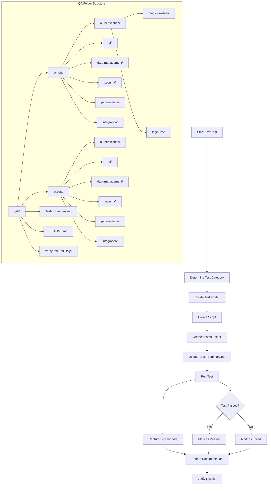

# QA Testing Framework - Cursor Custom Mode

## Overview
This QA framework provides automated testing capabilities for the Over The Hill application using Puppeteer for browser automation, screenshot capture, and comprehensive test documentation.

## Framework Structure



## Quick Start

### Prerequisites
```bash
# Install dependencies
pnpm add puppeteer

# Start the app
npm run dev
```

### Run Existing Tests
```bash
# Run authentication tests
node QA/scripts/authentication/magic-link-test/run.js
node QA/scripts/authentication/login-test/run.js

# Verify test results
node QA/verify-test-results.js
```

## Creating New Tests

### 1. Determine Test Category
Choose the appropriate category for your test:
- **Authentication**: Login, registration, password reset
- **UI**: User interface, navigation, forms
- **Data Management**: CRUD operations, import/export
- **Security**: Access control, validation, protection
- **Performance**: Load testing, response times
- **Integration**: External services, APIs

### 2. Create Test Structure
```bash
# Create test folders (replace category and test-name)
mkdir -p QA/scripts/{category}/{test-name} QA/assets/{category}/{test-name}
```

### 3. Create Test Script Template
Create `QA/scripts/{category}/{test-name}/run.js`:

```javascript
const puppeteer = require('puppeteer');
const path = require('path');

async function testName() {
  console.log('🚀 Test Name');
  console.log('============');
  
  let browser;
  let page;
  const testResults = {
    step1: { status: 'Failed', screenshot: null },
    step2: { status: 'Failed', screenshot: null },
    // Add more steps as needed
  };
  
  try {
    // Launch browser
    console.log('1. Launching browser...');
    browser = await puppeteer.launch({ 
      headless: false,
      args: ['--no-sandbox', '--disable-setuid-sandbox']
    });
    
    page = await browser.newPage();
    
    // Step 1: Navigate to the app
    console.log('2. Navigating to localhost:3001...');
    await page.goto('http://localhost:3001', { waitUntil: 'networkidle2' });
    await new Promise(resolve => setTimeout(resolve, 3000));
    
    // Take screenshot for Step 1
    const step1Screenshot = path.join(__dirname, '../../assets/{category}/{test-name}/step1-description.png');
    await page.screenshot({ path: step1Screenshot, fullPage: true });
    testResults.step1 = { status: 'Passed', screenshot: 'step1-description.png' };
    console.log('✅ Step 1: Description');
    
    // Step 2: Perform action
    console.log('3. Performing action...');
    // Add your test logic here
    
    // Take screenshot for Step 2
    const step2Screenshot = path.join(__dirname, '../../assets/{category}/{test-name}/step2-description.png');
    await page.screenshot({ path: step2Screenshot, fullPage: true });
    testResults.step2 = { status: 'Passed', screenshot: 'step2-description.png' };
    console.log('✅ Step 2: Description');
    
    // Add more steps as needed...
    
    // Print test summary
    console.log('\n📋 Test Results Summary:');
    console.log('========================');
    Object.entries(testResults).forEach(([step, result]) => {
      console.log(`${step}: ${result.status}`);
    });
    
    // Check overall test result
    const allPassed = Object.values(testResults).every(result => result.status === 'Passed');
    if (allPassed) {
      console.log('\n🎉 TEST PASSED: All steps completed successfully!');
    } else {
      console.log('\n❌ TEST FAILED: Some steps failed');
    }
    
  } catch (error) {
    console.error('❌ Test failed:', error.message);
  } finally {
    if (browser) {
      await browser.close();
    }
  }
}

// Run the test
testName().catch(console.error);
```

### 4. Update Tests-Summary.md
Add a new section to `QA/Tests-Summary.md` under the appropriate category:

```markdown
### Test Name

#### Description
Brief description of what this test validates.

#### Script
- QA/scripts/{category}/{test-name}/run.js

#### Steps

| Steps | Expected Behavior | Actual Behavior | Screenshot | Status |
| --- | --- | --- | --- | --- |
| Step 1 | Expected behavior description | Actual behavior with screenshot |  | Passed |
| Step 2 | Expected behavior description | Actual behavior with screenshot |  | Passed |
```

### 5. Run and Document
```bash
# Run the test
node QA/scripts/{category}/{test-name}/run.js

# Verify results
node QA/verify-test-results.js

# Update Tests-Summary.md with actual results
```

## Test Development Guidelines

### Screenshot Naming Convention
- `step1-{action}.png` - Initial state
- `step2-{action}.png` - After user interaction
- `step3-{action}.png` - After system response
- `step4-{action}.png` - Final state

### Test Structure Best Practices
1. **Clear Steps**: Each step should have a single, clear action
2. **Screenshot Capture**: Take screenshots at each step for documentation
3. **Error Handling**: Include proper error handling and logging
4. **Status Tracking**: Track pass/fail status for each step
5. **Documentation**: Update Tests-Summary.md with actual results

### Common Test Patterns

#### Authentication Tests
```javascript
// Login flow
await page.type('input[type="email"]', 'test@example.com');
await page.type('input[type="password"]', 'password');
await page.click('button[type="submit"]');
```

#### Form Interaction Tests
```javascript
// Fill form fields
await page.type('input[name="field"]', 'value');
await page.select('select[name="dropdown"]', 'option');
await page.click('input[type="checkbox"]');
```

#### Navigation Tests
```javascript
// Navigate and wait
await page.goto('http://localhost:3001/path');
await page.waitForSelector('selector');
```

## Verification Commands

```bash
# Check test setup
node QA/verify-test-results.js

# Run specific test
node QA/scripts/{category}/{test-name}/run.js

# View test documentation
cat QA/Tests-Summary.md

# Check app status
curl -I http://localhost:3001
```

## Troubleshooting

### Common Issues
1. **App not running**: Ensure `npm run dev` is started
2. **Puppeteer not installed**: Run `pnpm add puppeteer`
3. **Screenshots not saving**: Check folder permissions
4. **Test timing issues**: Increase wait times in script

### Debug Mode
```javascript
// Add to test script for debugging
await page.screenshot({ path: 'debug.png', fullPage: true });
console.log('Page content:', await page.content());
```

## Framework Benefits

- **Organized Testing**: Categorized tests for easy management
- **Automated Testing**: Browser automation with Puppeteer
- **Visual Documentation**: Screenshots for each test step
- **Comprehensive Tracking**: Pass/fail status for each step
- **Easy Maintenance**: Organized folder structure
- **Quick Verification**: Built-in verification tools
- **Extensible**: Easy to add new tests and categories

This framework provides a robust foundation for automated testing with visual documentation and comprehensive result tracking, organized by logical categories for better scalability. 