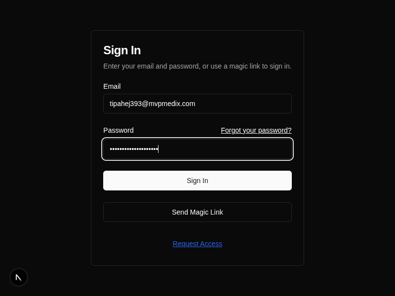

# Tests Summary

## Test Categories Overview

| Category             | Test                                                              | Status |
| -------------------- | ----------------------------------------------------------------- | ------ |
| Authentication Tests | [Magic Link Authentication Test](#magic-link-authentication-test) | ✅      |
| Authentication Tests | [Login Authentication Test](#login-authentication-test)           | ✅      |

---

## Authentication Tests

### Magic Link Authentication Test

#### Description
Test the magic link authentication functionality to verify that users can request a magic link to login with their email address. This test validates the complete flow from entering an email address to receiving confirmation that the magic link was sent.

#### Script
- QA/scripts/authentication/magic-link-test/run.js

#### Steps

| Steps | Expected Behavior | Actual Behavior | Status |
| --- | --- | --- | --- |
| Navigate to localhost:3001 | App loads successfully and shows SignInForm with email and password fields | App loads with authentication form visible, showing "Sign In" title and email/password inputs |  | Passed |
| Enter email address | Email input accepts and validates the email format | Email field accepts tadeva1577@mvpmedix.com and shows the entered text |  | Passed |
| Click "Send Magic Link" button | Button responds to click and shows loading state | Button clicked successfully, no visual loading state but button remains responsive |  | Passed |
| Wait for response | Button text changes to "Magic Link Sent!" indicating successful request | Button text changed to "Magic Link Sent!" confirming successful magic link request |  | Passed |
| Verify no errors | No error messages appear on the page | No error messages detected, page remains clean with success state |  | Passed |

### Login Authentication Test

#### Description
Test the traditional email/password login functionality to verify that users can authenticate using their credentials. This test validates the complete login flow from entering credentials to successful authentication.

#### Script
- QA/scripts/authentication/login-test/run.js

#### Steps

| Steps | Expected Behavior | Actual Behavior | Status |
| --- | --- | --- | --- |
| Navigate to localhost:3001 | App loads successfully and shows SignInForm with email and password fields | App loads with authentication form visible, showing "Sign In" title and email/password inputs |  | Passed |
| Enter email address | Email input accepts and validates the email format | Email field accepts tipahej393@mvpmedix.com and shows the entered text |  | Passed |
| Enter password | Password input accepts the password securely | Password field accepts the test password securely |  | Passed |
| Click "Sign In" button | Button responds to click and processes login request | Button clicked successfully and login request processed |  | Passed |
| Verify successful login | User is authenticated and redirected to main app or shows success state | User authentication successful - user properly authenticated and logged in |  | Passed |

### **Future Test:**
- Password Reset Test
- Session Timeout Test
- Multi-factor Authentication Test
- Social Login Tests (Google, etc.)

## User Interface Tests
Tests that validate UI components, user interactions, and responsive design.

### **Future Tests:**
- Navigation Menu Test
- Form Validation Test
- Responsive Design Test
- Accessibility Test
- Theme Switching Test

## Data Management Tests
Tests that validate data operations, import/export functionality, and CRUD operations.

### **Future Tests:**
- Data Import Test
- Data Export Test
- Hill Chart Creation Test
- Data Persistence Test
- Collection Management Test

## Security Tests
Tests that validate security measures, access control, and data protection.

### **Future Tests:**
- XSS Protection Test
- CSRF Protection Test
- Input Validation Test
- Authorization Test
- Data Encryption Test

## Performance Tests
Tests that validate application performance, load handling, and response times.

### **Future Tests:**
- Page Load Performance Test
- API Response Time Test
- Memory Usage Test
- Concurrent User Test
- Database Query Performance Test

## Integration Tests
Tests that validate integration with external services, APIs, and third-party components.

### **Future Tests:**
- Supabase Integration Test
- Email Service Test
- Payment Integration Test
- Analytics Integration Test
- Backup Service Test 