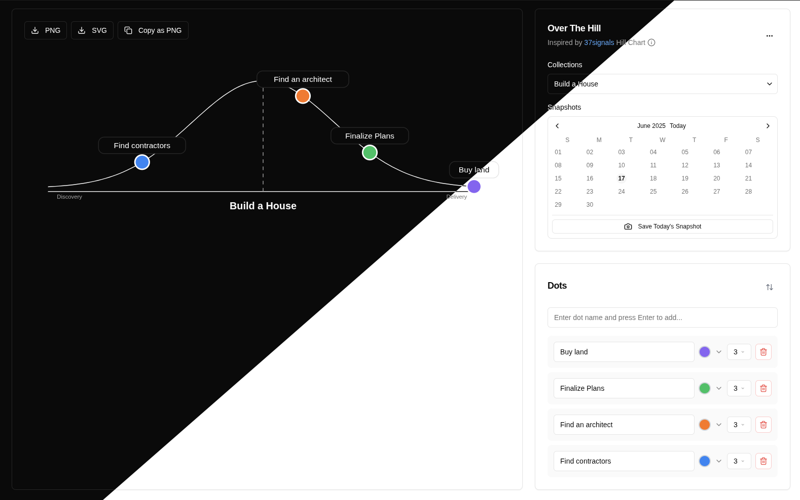

# Over The Hill
Inspired by [37signals](https://37signals.com/) Hill Chart

[37signals](https://37signals.com/) Hill Charts are a great way to visually communicate
progress and incoming work.

Read [Shape Up: Show Porgress (Chapt. 13)](https://basecamp.com/shapeup/3.4-chapter-13) to discover the technique.

*Automatically synced with your [v0.dev](https://v0.dev) deployments*

[](https://v0.dev/chat/projects/QlICJdqcWMK)


## What is Over The Hill?

Over The Hill is a web and desktop application designed to visualize project progress using a "Hill Chart." A Hill Chart is a simple yet powerful tool for tracking the status of tasks or features, categorizing them into two main phases: "Up the Hill" (discovery/problem-solving) and "Down the Hill" (execution/implementation).

### See Video Introduction
[](https://youtu.be/SvkJ-YrMq6o)   


### Join in [overthehill.faurobert.fr](https://overthehill.faurobert.fr)



## Development Setup

### Prerequisites
- Node.js 18+ and npm/pnpm
- A Supabase project

### Environment Configuration

**Option 1: Interactive Setup (Recommended)**
Run the setup script for guided configuration:
```bash
./setup-env.sh
```

**Option 2: Manual Setup**
1. Copy the environment template:
   ```bash
   cp .env.example .env.local
   ```

2. Fill in your Supabase credentials in `.env.local`:
   ```env
   NEXT_PUBLIC_SUPABASE_URL=https://your-project-id.supabase.co
   NEXT_PUBLIC_SUPABASE_ANON_KEY=your_supabase_anon_key_here
   SUPABASE_SERVICE_ROLE_KEY=your_supabase_service_role_key_here
   ```

3. Get these values from your [Supabase project dashboard](https://supabase.com/dashboard):
   - Go to **Settings** > **API**
   - Copy the **Project URL** and **anon/public key**
   - Copy the **service_role key** (keep this secure!)

### Running the Application
```bash
# Install dependencies
npm install

# Run development server
npm run dev
# or: pnpm dev

# Build for production
npm run build
```

The application will be available at `http://localhost:3000`.

This app now operates as a **multi-tenant SaaS platform** with secure, per-user data isolation, powered by **Supabase** as the backend. Access is **invite-only** (no public signup), and all user data is securely stored and managed in the cloud.

This app allows you to:

*   **Create and manage "dots"**: Each dot represents a task, feature, or item you want to track.
*   **Position dots on the hill**: Drag and drop dots to indicate their progress. Dots on the left side are "Up the Hill" (still figuring things out), and dots on the right side are "Down the Hill" (known work, being executed).
*   **Customize dots**: Assign names, colors (blue, green, red, orange, purple), and sizes (1-5) to each dot for better categorization and visual distinction.
*   **Organize with collections**: Group related dots into collections to manage multiple projects or different aspects of a single project.
*   **Export your chart**: Copy the generated hill chart as a PNG image or an SVG file to your clipboard, or download it as a PNG file, for easy sharing and documentation.
*   **Theme support**: Switch between light, dark, or system-preferred themes for a comfortable viewing experience.
*   **Snapshot system**: Save and restore the state of your collections at any point in time, with calendar-based navigation and visual indicators.
*   **Import/Export**: Import or export your data as JSON for backup or migration.
*   **Authentication & Access Control**: Sign in with an invite, request access, and enjoy per-user data isolation. All data is securely stored in Supabase.

## How to Use

1.  **Sign In / Request Access**: Visit the app and sign in with your invite, or request access if you are a new user. (No public signup; access is managed by the admin.)
2.  **Add Dots**: Click the "Add Dot" button to create a new task or item.
3.  **Name and Customize**: In the dot editing panel, give your dot a name, and select its color and size using the dropdowns.
4.  **Position on the Hill**: Drag the dot on the hill chart to reflect its current status.
    *   **Up the Hill (Left Side)**: For tasks where you're still exploring, researching, or solving problems.
    *   **Down the Hill (Right Side)**: For tasks where the path is clear, and you're actively implementing.
5.  **Manage Collections**: Use the "Collections" dropdown to create new collections, switch between them, or manage existing ones.
6.  **Snapshots**: Use the snapshot button to save the current state of your collections. Navigate the calendar to view and restore previous snapshots.
7.  **Export/Share**:
    *   Click the ellipsis menu (`...`) in the top right corner.
    *   Under "Export Clipboard Format," choose "Copy as PNG" or "Copy as SVG" to set the clipboard format.
    *   Click the "Copy" button in the chart header to copy the chart to your clipboard in the selected format.
    *   Click the "Download PNG" button to save the chart as a PNG file to your system.
8.  **Theme Switching**: Use the ellipsis menu (`...`) to toggle between "Light," "Dark," or "Follow Browser" themes.

## Technical Stack

- **Frontend**: Next.js 15.2.4, React 19, TypeScript
- **Styling**: Tailwind CSS, shadcn/ui, Radix UI
- **Backend**: Supabase (Postgres, Auth, Row-Level Security, Storage)
- **State Management**: React hooks, Supabase for persistence
- **Export**: HTML5 Canvas API for PNG, SVG manipulation
- **Theme**: next-themes

## Demo

Try it out live at:

**[https://demo.overthehill.faurobert.fr/](https://demo.overthehill.faurobert.fr/)**

## Desktop App
If you prefer running the app only locally, check out the latest [Releases](https://github.com/gfaurobert/over-the-hill/releases)

## Documentation

Check our documentation on [https://docs.overthehill.faurobert.fr/](https://docs.overthehill.faurobert.fr/)
