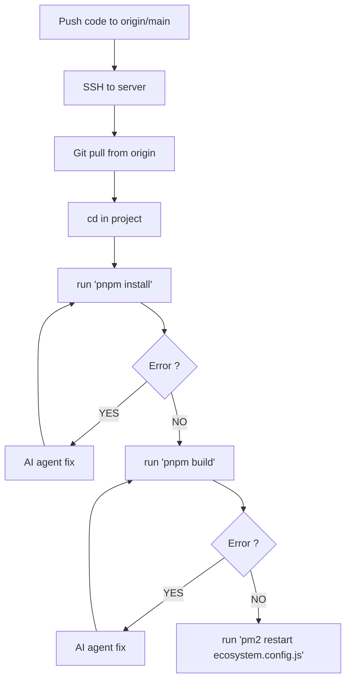
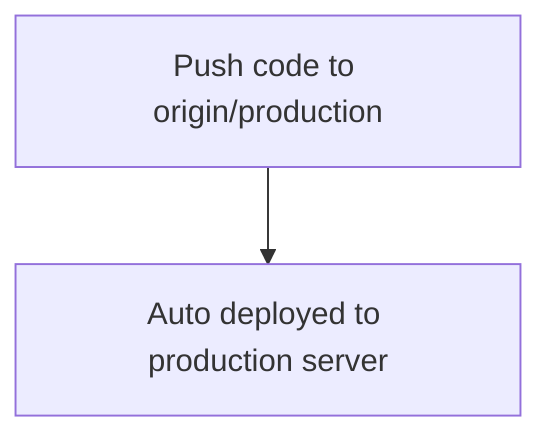
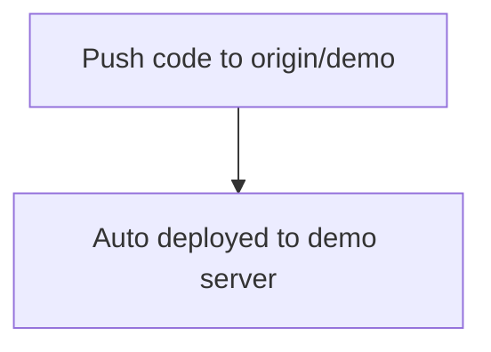

# CI/CD Process

## Manual Process

Current manual process is:



## Steps

1. **Push code to origin/main** — Trigger: push to main branch.
2. **SSH to server** — Connect to the deployment server.
3. **Git pull from origin** — Pull latest code on the server.
4. **cd in project** — Navigate to the project directory.
5. **run 'pnpm install'** — Install/update dependencies.
6. **Error?** — If install fails → AI agent fix, then retry install. If OK → continue.
7. **run 'pnpm build'** — Build the project.
8. **Error?** — If build fails → AI agent fix, then retry build. If OK → continue.
9. **run 'pm2 restart ecosystem.config.js'** — Restart the app via PM2.


## Target Process

### Production



### Demo



---

## How to get to the Target Process

To go from the manual process to **push → auto deploy**, automate the same steps in a CI/CD pipeline:

| Manual step | Automation |
|-------------|------------|
| Push to main | Push to `origin/production` (or another branch) as the **trigger** |
| SSH + git pull + cd | Runner **checks out** the repo (or use SSH + `git pull` in the job) |
| `pnpm install` | Run **`pnpm install`** in the pipeline; pipeline fails if it errors |
| `pnpm build` | Run **`pnpm build`** in the pipeline; pipeline fails if it errors |
| `pm2 restart` | **Deploy step**: SSH into the server and run `git pull`, `pnpm install`, `pnpm build`, `pm2 restart` (or copy build artifacts and restart) |

**Options:**

1. **GitHub Actions** (if the repo is on GitHub)  
   - Workflow on `push` to `production` (or `main`).  
   - Jobs: install deps → build → (optional) run tests → deploy.  
   - Deploy via **SSH**: use `appleboy/ssh-action` or a script that SSHs to the server and runs the same commands you run today (pull, install, build, pm2 restart).  
   - Store server host, user, and SSH key in repo **Secrets**.

2. **GitLab CI / other CI**  
   - Same idea: pipeline on push to `production`, run install + build (and tests), then a deploy job that SSHs to the server and runs the deploy commands.

3. **Deploy key**  
   - Add a deploy key or SSH key to the server so the runner can SSH in without a password.  
   - Restrict the key to only run the deploy script if possible.

4. **Branch strategy**  
   - Keep using `main` for development and use `production` (or `release`) only for deploys, so “push to origin/production” = “deploy to production”.

**Minimal path:** one workflow that on push to `production` runs `pnpm install` and `pnpm build`, then SSHs to the server and runs your current manual commands (pull, install, build, pm2 restart). That gives you the target: **push to origin/production → auto deployed to production server**.

---

## Step-by-step: GitHub Actions


### 1. Generate an SSH key for the GitHub runner

On your machine:

```bash
ssh-keygen -t ed25519 -C "github-actions-deploy" -f deploy_key -N ""
```

With `-f deploy_key`, the keys are created in the **current directory** where you run the command: `deploy_key` (private) and `deploy_key.pub` (public). Run this from a safe place (e.g. your home directory or a temp folder), not inside the repo. After you’ve added the private key to GitHub Secrets, you can delete both files from your machine.  
**Do not commit the private key.**

### 2. Add the public key to the server

From your machine (with your normal SSH access to the server), use `ssh-copy-id` so the deploy key can log in:

```bash
# Default port (22):
ssh-copy-id -i deploy_key.pub USER@HOST

# Custom SSH port (use -p and set SSH_PORT / DEMO_SSH_PORT in GitHub secrets):
ssh-copy-id -i deploy_key.pub -p PORT USER@HOST
```

Replace `USER` and `HOST` with the same user and host you use for the deploy (e.g. `deploy@bloc-encoches.com`). If the server uses a non-default SSH port, use `-p PORT` and add that same port as the `SSH_PORT` (or `DEMO_SSH_PORT`) secret. Enter your password when prompted. The public key is appended to `~/.ssh/authorized_keys` on the server with correct permissions.

**If `ssh-copy-id` isn’t available** (e.g. on some Windows setups), SSH in and add the key manually:

```bash
ssh USER@HOST
mkdir -p ~/.ssh && chmod 700 ~/.ssh
echo "PASTE_CONTENTS_OF_deploy_key.pub" >> ~/.ssh/authorized_keys
chmod 600 ~/.ssh/authorized_keys
```

### 3. Add repository secrets on GitHub

In the repo: **Settings → Secrets and variables → Actions → New repository secret.**

**Production (server 1)** — push to `production` deploys here:

| Name | Value | Notes |
|------|--------|------|
| `SSH_HOST` | Production server hostname or IP | e.g. `bloc-encoches.com` |
| `SSH_USER` | User used for SSH | e.g. `deploy` or `root` |
| `SSH_PRIVATE_KEY` | Entire contents of the production deploy key | Including `-----BEGIN ... -----` and `-----END ... -----` |
| `SERVER_PROJECT_DIR` | Full path to the repo on production | e.g. `/home/deploy/beton-env-platform` |
| `SSH_PORT` | (optional) SSH port | e.g. `2222`. Omit or set to `22` for default. |

**Demo (server 2)** — push to `demo` deploys here. Use a second key and add its public key to the demo server (same as step 2, but for the demo host). Then add:

| Name | Value | Notes |
|------|--------|------|
| `DEMO_SSH_HOST` | Demo server hostname or IP | e.g. `demo.example.com` |
| `DEMO_SSH_USER` | User used for SSH on demo | e.g. `deploy` |
| `DEMO_SSH_PRIVATE_KEY` | Entire contents of the demo deploy key | Second key, added to demo server’s `authorized_keys` |
| `DEMO_SERVER_PROJECT_DIR` | Full path to the repo on demo server | e.g. `/home/deploy/beton-env-platform` |
| `DEMO_SSH_PORT` | (optional) SSH port for demo | e.g. `2222`. Omit or set to `22` for default. |

### 4. Add the workflow files

Two workflows in the repo:

- **`.github/workflows/deploy-production.yml`** — runs only on push to `production`. Build + build-in-container, then deploy to server 1 (production secrets).
- **`.github/workflows/deploy-demo.yml`** — runs only on push to `demo`. Build + build-in-container, then deploy to server 2 (demo secrets).

Each workflow is independent: pushing to `production` runs only the production workflow; pushing to `demo` runs only the demo workflow. On the server the deploy step does: `git pull`, then **root** `pnpm install`, then `./deploy/release-actions.sh` (always; exits 0 when there are no scripts), then `./supabase/scripts/runMigrations.sh`, then for **beton-env** and **beton-env-admin** (in turn): `cd <app>`, `pnpm install`, `pnpm build`, then `pm2 restart` for both apps (using each app’s `ecosystem.config.js`). Adjust the workflows if your commands or paths differ.

`deploy/release-actions.sh` is the hook for one-off or idempotent server-side changes that should run during a deploy. It looks for `*.sh` files in `deploy/release-scripts` and executes each one (in sorted order). If the directory does not exist or contains no scripts, it logs that there are no release actions to perform and exits successfully.

### 5. (Optional) Restrict the deploy key on the server

To limit what the key can do, use a dedicated deploy user and (if you use a single repo) a `command=` in `authorized_keys` so the key only runs a deploy script. For a first version, reusing your current user and full shell is fine.

### 6. Deploy

**To production (server 1):**

```bash
git checkout production
git merge main   # or cherry-pick the commits you want
git push origin production
```

**To demo (server 2):**

```bash
git checkout demo
git merge main   # or the commits you want
git push origin demo
```

Go to **Actions** on GitHub and watch the workflow. Only the deploy job for the branch you pushed runs (production or demo). If install or build fails, the deploy is skipped.