You have 3 options, you can use the [Web App](#the-web-app) (requires signing up), you can install the [Desktop App](#the-desktop-app) (no cloud sync) or [self-host]() the app (requires setting up a Supabase backend)
## The Web App
Follow the link below and click the `Request Access` link.

Link [overthehill.faurobert.fr](https://overthehill.faurobert.fr)

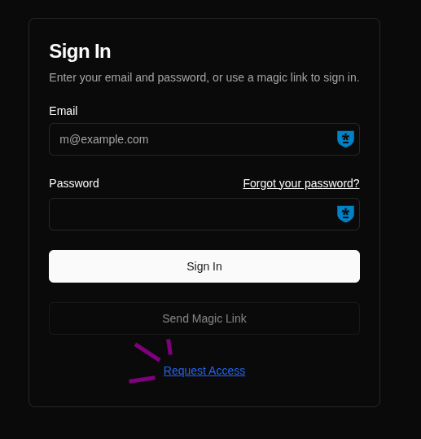
## The Desktop App
First, if you are on Windows or macOS use the following dedicated guides:
- Download and Install the Desktop App (Windows) - Coming Soon
- Download and Install the Desktop App (macOS) - Coming Soon

Only need the app on 1 computer and you don't require cloud backup, than head to the release page to grab the latest AppImage. You will enjoy all of the feature except the syncing capabilities.

## Download the latest release
- Find the latest release here: [github.com/gfaurobert/over-the-hill/releases](https://github.com/gfaurobert/over-the-hill/releases)
- Download the App Image in the assets section
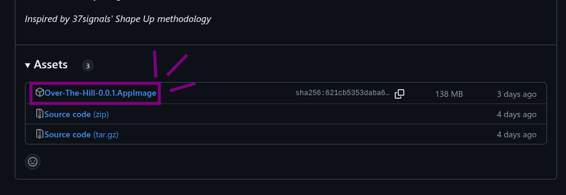
## Run the App Image
- Once downloaded, execute the App Image

If the app doesn't launch or is blank (like shown below)

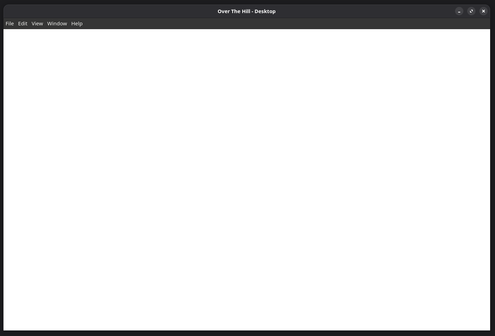

Then open up your terminal where the App Image is located and run the App Image with the flag `--no-sandbox`

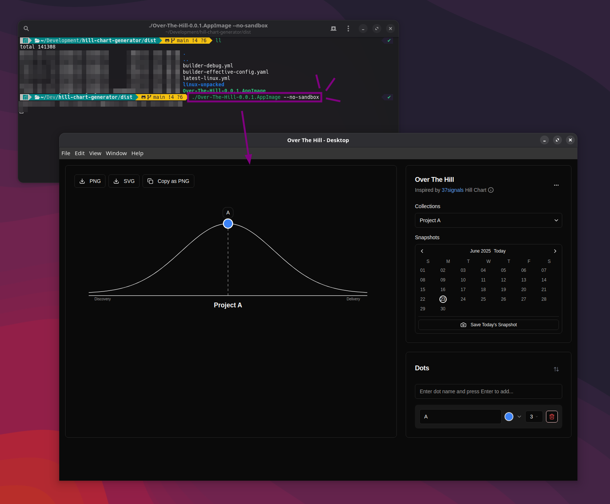

## Install on your system

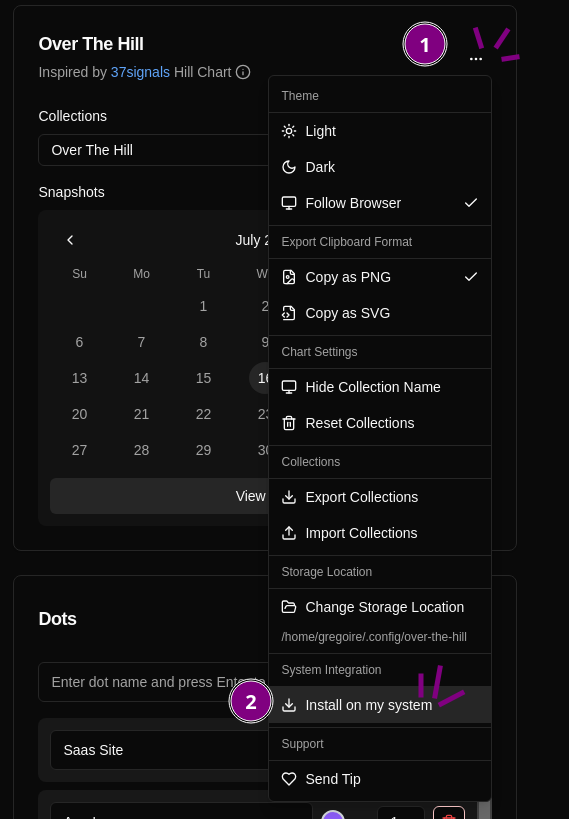

The App comes with an installation script, that copies the App Image into your `$HOME/.local/bin/over-the-hill` folder and create a desktop entry at `$HOME/.local/share/application/over-the-hill.desktop`

All of the data are stored locally in you home directory under `$HOME/.config/over-the-hill`

You can change the storage location in the app as shown below

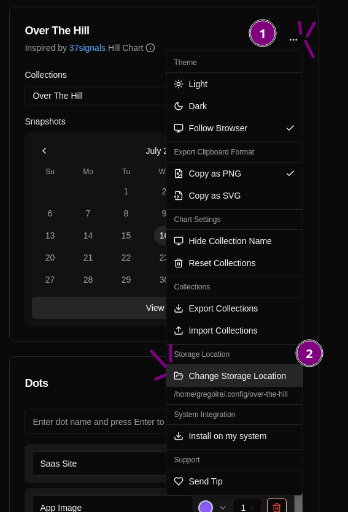
## Create you first Collection

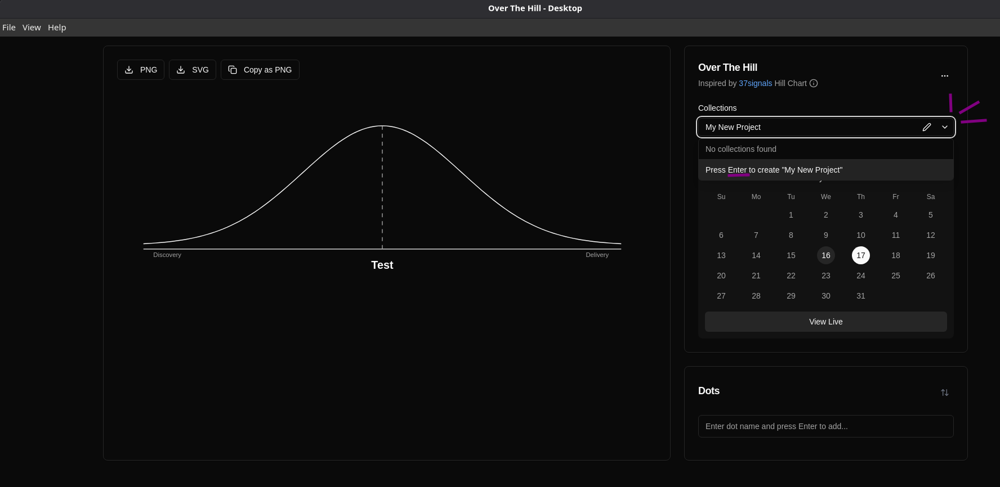

## Add and Tweak Dots

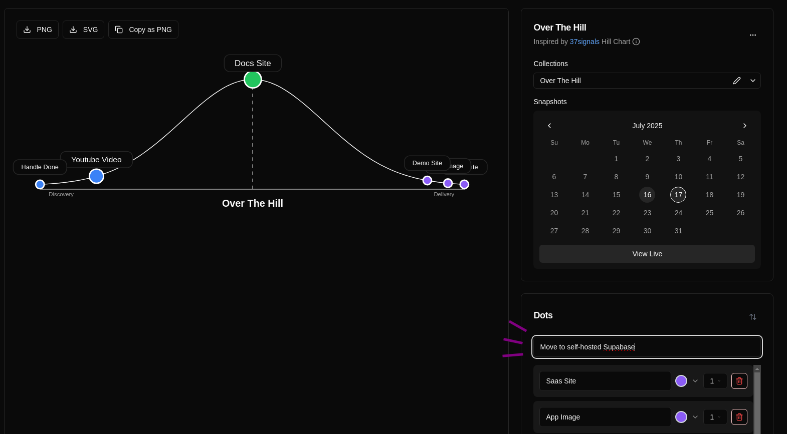

After adding a dot, you can edit its name, change its color, or adjust its size.

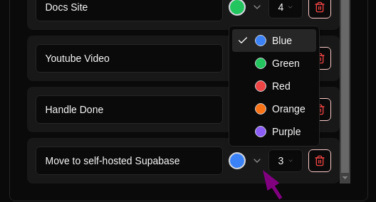

The color coding represent a status

| Color | Status              |
| ----- | ------------------- |
| 🔵    | Discovery           |
| 🟢    | Delivery - On Track |
| 🟠    | Delivery - At Risk  |
| 🔴    | Delivery - Blocked  |
| 🟣    | Delivery - Done     |

The size options allow you to condense the dots if there are many or to maximize or minimize their visibility based on the goals of the presentation the chart is included in.

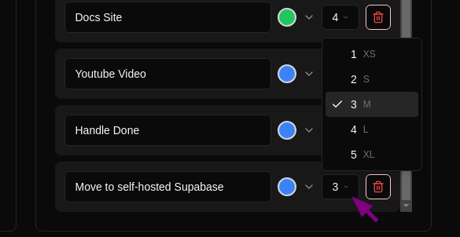
## Export as Image / Copy to Clipboard

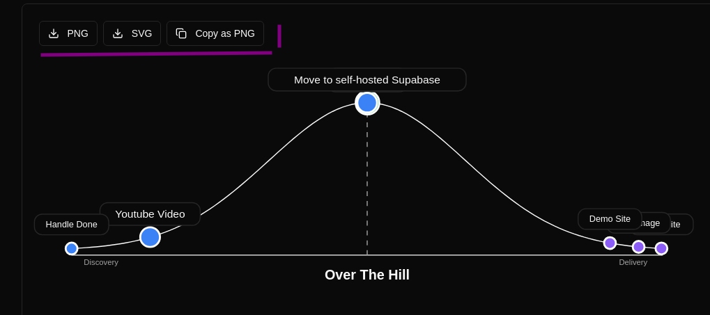

## Make snapshots

Create a snapshot for the day. Clicking the button multiple times will store the latest snapshot as the day's snapshot.

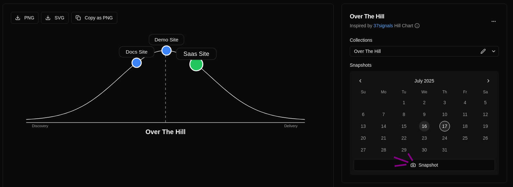

Visualize daily snapshots on a calendar, where clicking a day displays its Hill Chart, and select 'View Live' to see the current snapshot.
